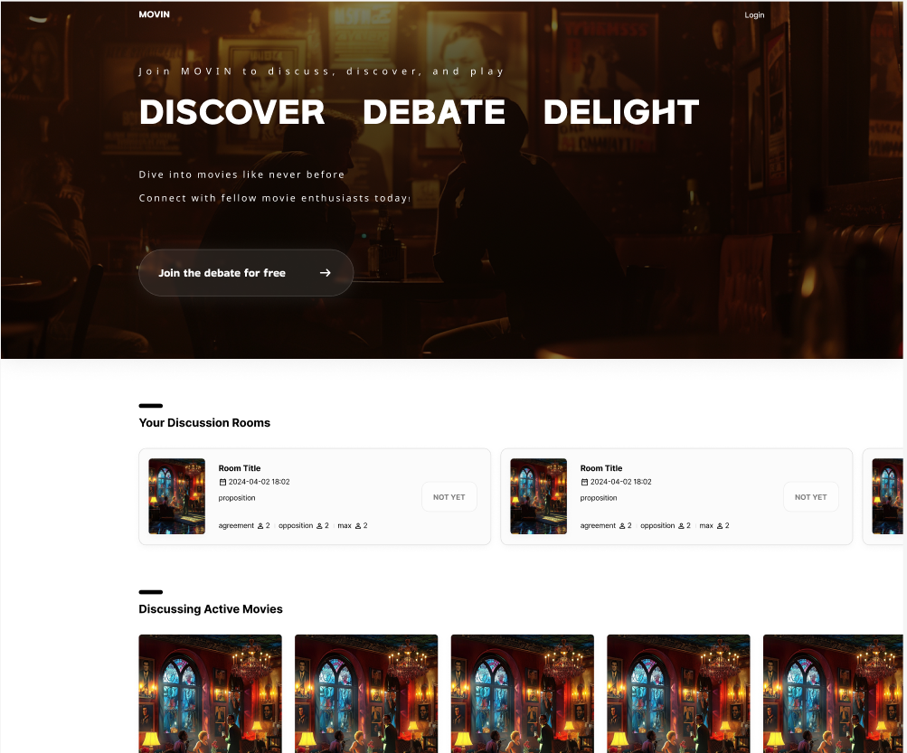
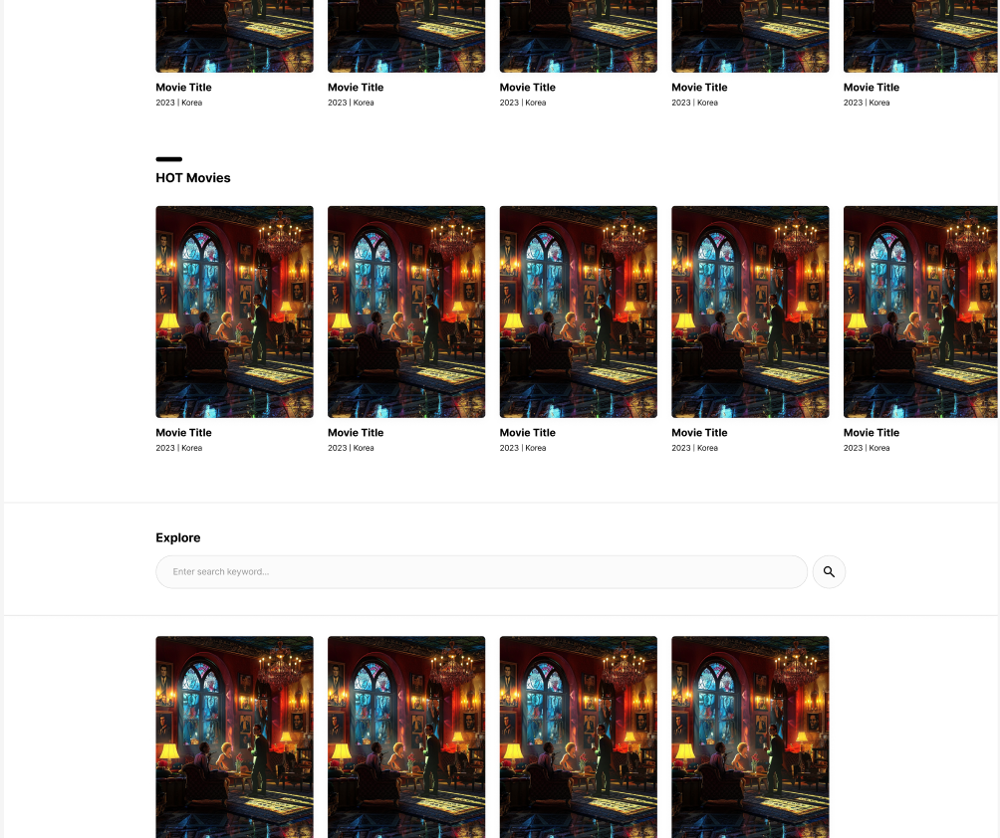
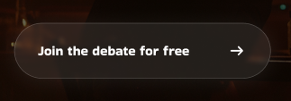
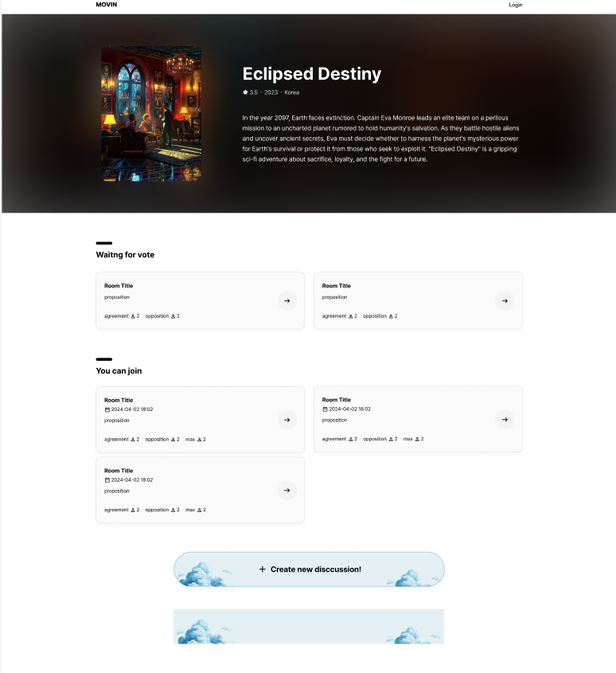
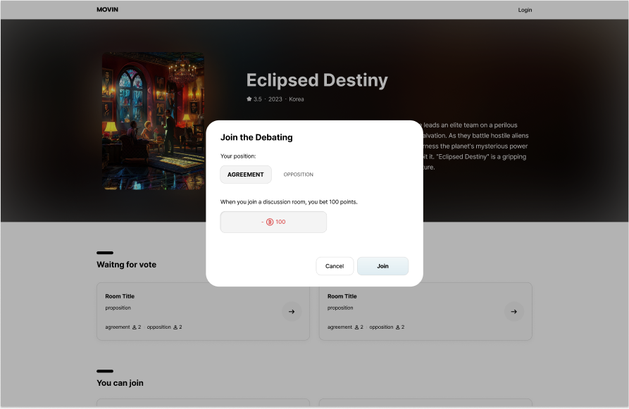
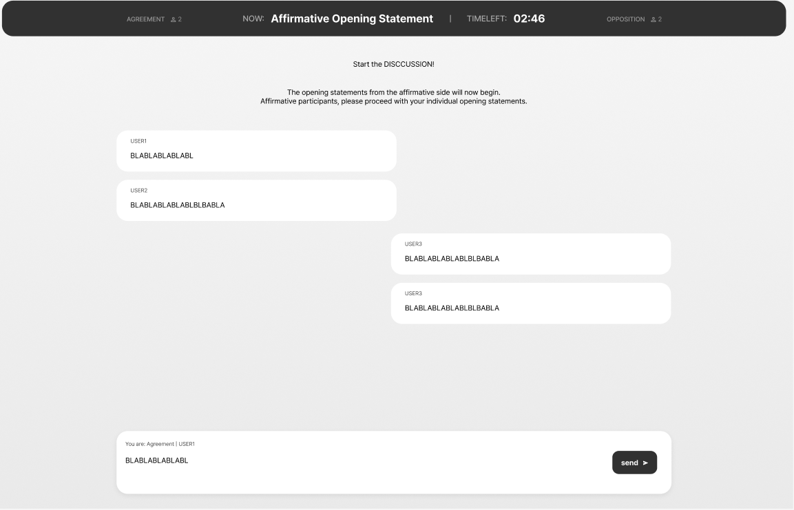
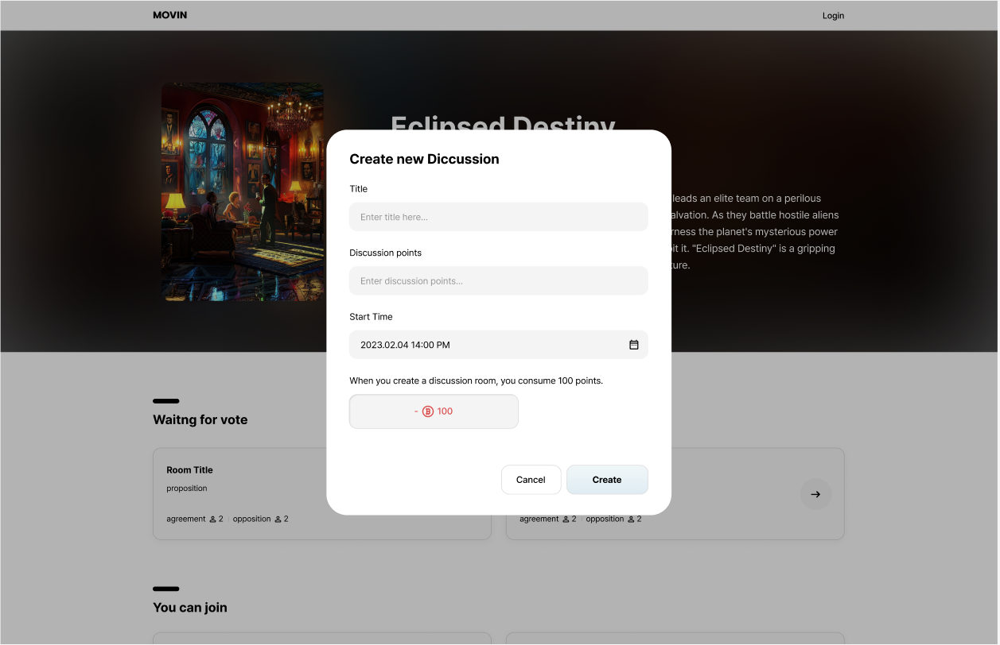
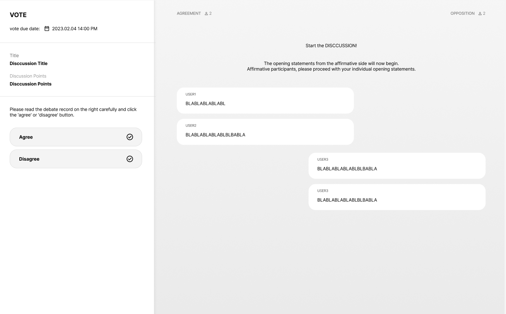
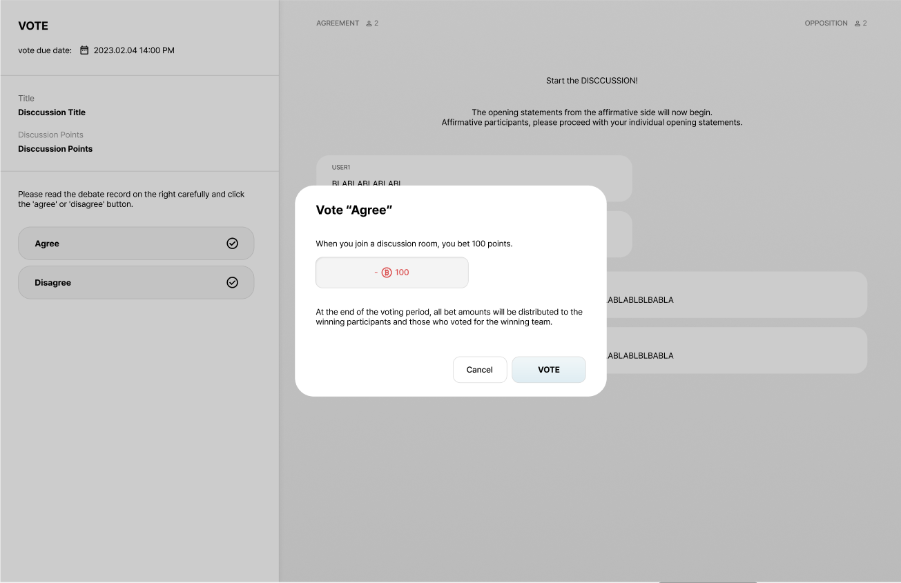
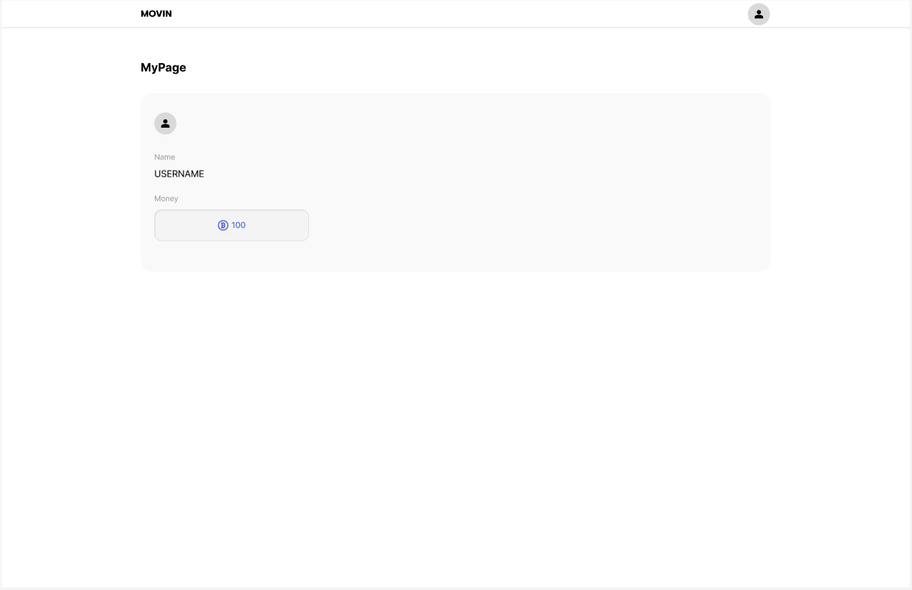

# Getting Started with Create React App

This project was bootstrapped with [Create React App](https://github.com/facebook/create-react-app).

## Available Scripts

In the project directory, you can run:

### `npm start`

Runs the app in the development mode.\
Open [http://localhost:3000](http://localhost:3000) to view it in the browser.

The page will reload if you make edits.\
You will also see any lint errors in the console.

### `npm test`

Launches the test runner in the interactive watch mode.\
See the section about [running tests](https://facebook.github.io/create-react-app/docs/running-tests) for more information.

### `npm run build`

Builds the app for production to the `build` folder.\
It correctly bundles React in production mode and optimizes the build for the best performance.

The build is minified and the filenames include the hashes.\
Your app is ready to be deployed!

See the section about [deployment](https://facebook.github.io/create-react-app/docs/deployment) for more information.

### `npm run eject`

**Note: this is a one-way operation. Once you `eject`, you can’t go back!**

If you aren’t satisfied with the build tool and configuration choices, you can `eject` at any time. This command will remove the single build dependency from your project.

Instead, it will copy all the configuration files and the transitive dependencies (webpack, Babel, ESLint, etc) right into your project so you have full control over them. All of the commands except `eject` will still work, but they will point to the copied scripts so you can tweak them. At this point you’re on your own.

You don’t have to ever use `eject`. The curated feature set is suitable for small and middle deployments, and you shouldn’t feel obligated to use this feature. However we understand that this tool wouldn’t be useful if you couldn’t customize it when you are ready for it.

## Learn More

You can learn more in the [Create React App documentation](https://facebook.github.io/create-react-app/docs/getting-started).

To learn React, check out the [React documentation](https://reactjs.org/).

# Milestone3 
## Main Page

This is our main page figure. 

In main page, user can access discussion room, HOT movie and Explore sections. 

User can join debate room to this button.

You can check the list of discussion rooms you have joined under **"Your Discussion Room"** \
You can also view a list of movies currently being discussed under **"Discussing Active Movie"**. \
You can also check out the list of trending movies based on ratings under **"HOT Movies"**. \
And also explore other movies under **"Explore"** section. \

## Debate room page
If you click **"Join the debate for free"** button, you will see this page.

In this page, you can participate other debate rooms and create new debate rooms. \
You can check the list of discussion rooms that are awaiting votes after the discussion has ended under **"Wating for vote"**. \
You can check the list of discussion rooms where you can participate in **"You can join"** section. \
Also you can create your debate room to **"Create new Discussion"** button.

## Join debate room popup
If you choose debate room which you want to participate in, you will see this popup.

This popup alert you really join this debate room. \
You can join debate room by paying 100 game money.
## Debate chat room page
If you join debate room, you will chat room to debate other participants.

In this room, participants will be assigned speaking turns by the GPT moderator, similar to a real debate. \
Agreements and Disagreements will have a designated time to express their opinions, after which further speech will not be allowed. \
Additionally, the GPT moderator will summarize both sides' views after the debate concludes.

## Create debate room popup
If you click **"Create new Discussion"** button, you will see this popup.

You can enter your debate room title, discussion point and starting time. \
It alerts that you must pay 100 game money to create debate room.
## Vote page
If you click one of list in **"Wating for vote"** section, you will see this page. 

You can vote for agree or disagree after reading chat logs. 
## Vote page popup
If you select agree or disagree, you will see this popup.

This popup alerts you your selection agree or disagree and you must pay 100 game money to vote in this room.
## My page

In this page, you can see your user name and game money. 
